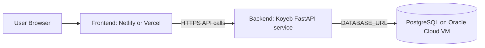

# Free Hosting Split Design

## Summary

This design changes the deployment target from a mostly single-stack or Azure-oriented setup to a free-tier-optimized split:

- Frontend: Netlify or Vercel
- Backend API: Koyeb
- Database: PostgreSQL running on Oracle Cloud Infrastructure Always Free

The goal is to keep the application architecture familiar to the current codebase while reducing platform cost and avoiding unnecessary Oracle Database compatibility work.

This design explicitly avoids switching the app from PostgreSQL to Oracle Database. Instead, it uses Oracle Cloud as the infrastructure provider for a self-hosted PostgreSQL instance.

## Why This Direction

The current repository is already much closer to a PostgreSQL-friendly deployment than an Oracle Database-native deployment:

- Backend dependencies are PostgreSQL-oriented in [requirements.txt](file:///c:/Users/USER/Project/Kids-Bible_platform/backend/requirements.txt)
- Existing local orchestration uses PostgreSQL in [docker-compose.yml](file:///c:/Users/USER/Project/Kids-Bible_platform/docker-compose.yml)
- Existing migrations and SQLAlchemy models assume PostgreSQL-compatible behavior, especially around JSON fields in [82cc201a7c56_initial_schema.py](file:///c:/Users/USER/Project/Kids-Bible_platform/backend/alembic/versions/82cc201a7c56_initial_schema.py)

Using Oracle Cloud to host PostgreSQL gives the user the cost advantage of Oracle’s free infrastructure without forcing a database-engine rewrite.

## Target Architecture

## Scope

This work includes:

- separating deployment assumptions for frontend and backend
- making the frontend clearly static-host friendly
- making the backend clearly Koyeb-host friendly
- documenting PostgreSQL-on-Oracle setup and connection requirements
- updating repository docs and learning materials where deployment guidance changes

This work does not include:

- rewriting the application for Oracle Database
- adding managed database automation for Oracle Cloud VM provisioning
- replacing local development Docker unless required for clarity

## Current State

### Frontend

The frontend is already close to Netlify/Vercel-ready:

- Vite app config exists in [vite.config.ts](file:///c:/Users/USER/Project/Kids-Bible_platform/frontend/vite.config.ts)
- SPA fallback is already present in [_redirects](file:///c:/Users/USER/Project/Kids-Bible_platform/frontend/public/_redirects)
- API base URL is already environment-driven in [api.ts](file:///c:/Users/USER/Project/Kids-Bible_platform/frontend/src/lib/api.ts)

### Backend

The backend is already a standalone FastAPI service:

- app entry in [main.py](file:///c:/Users/USER/Project/Kids-Bible_platform/backend/app/main.py)
- settings in [config.py](file:///c:/Users/USER/Project/Kids-Bible_platform/backend/app/core/config.py)
- DB session setup in [database.py](file:///c:/Users/USER/Project/Kids-Bible_platform/backend/app/core/database.py)

However, deployment guidance and environment assumptions still reflect older hosting directions and a single local compose stack.

### Database

The repo currently assumes PostgreSQL for non-local deployment and uses sqlite only as a lightweight default fallback. It is therefore safer to keep PostgreSQL as the production engine and move only the hosting location.

## Design Decisions

### 1. Frontend stays static

The frontend will be deployed as a static site to either Netlify or Vercel.

Requirements:

- build command remains `npm run build`
- publish directory remains `dist`
- `VITE_API_BASE_URL` must point to the Koyeb backend URL in production
- SPA routing must continue to work

Expected repo changes:

- add explicit hosting docs for Netlify and Vercel
- optionally add platform config files only if they improve clarity
- keep `_redirects` for Netlify
- document Vercel SPA fallback behavior if a `vercel.json` is added

### 2. Backend becomes Koyeb-oriented

The backend will be deployed independently to Koyeb as a Python web service.

Requirements:

- startup command must be production-safe
- environment variables must be clearly documented
- CORS must allow the frontend production origin
- health check path should remain `/health`

Expected repo changes:

- update deployment docs for Koyeb service creation
- ensure backend build/run instructions are straightforward for Koyeb
- confirm current `uvicorn app.main:app --host 0.0.0.0 --port 8000` startup remains valid

### 3. PostgreSQL stays the app database

The application will continue using PostgreSQL, but the database host will be an Oracle Cloud VM running PostgreSQL.

Requirements:

- keep SQLAlchemy PostgreSQL compatibility
- keep Alembic migration flow
- document VM setup, PostgreSQL installation, firewall/security list rules, and connection string construction
- require SSL or document the best available secure path depending on Oracle VM setup

Expected repo changes:

- deployment docs for PostgreSQL on Oracle Cloud VM
- environment variable examples updated to reflect remote PostgreSQL
- possibly clarify driver expectations in backend docs

## Repo Changes Planned

### Application Code

Minimal code changes are preferred. Expected code-level updates are mostly configuration and environment clarity:

- frontend API base URL documentation around [api.ts](file:///c:/Users/USER/Project/Kids-Bible_platform/frontend/src/lib/api.ts)
- backend configuration guidance around [config.py](file:///c:/Users/USER/Project/Kids-Bible_platform/backend/app/core/config.py)
- possible hosting config files for Netlify/Vercel

### Documentation

The main changes are documentation-heavy:

- update [README.md](file:///c:/Users/USER/Project/Kids-Bible_platform/README.md)
- replace or expand [DEPLOYMENT.md](file:///c:/Users/USER/Project/Kids-Bible_platform/DEPLOYMENT.md)
- update [docs/wiki/hosting-docs.md](file:///c:/Users/USER/Project/Kids-Bible_platform/docs/wiki/hosting-docs.md)
- update any beginner deployment references under [docs/beginner-code-roadmap](file:///c:/Users/USER/Project/Kids-Bible_platform/docs/beginner-code-roadmap)

### Local Development

Local development should remain simple:

- `docker-compose.yml` can still be used for local frontend + backend + PostgreSQL
- production hosting must no longer imply that the same compose layout is the deployment model

This preserves a beginner-friendly local workflow while allowing a different production topology.

## Environment Variables

### Frontend

- `VITE_API_BASE_URL`: production URL of the Koyeb backend, for example `https://<your-api>.koyeb.app/api/v1`

### Backend

- `DATABASE_URL`: PostgreSQL connection string pointing to Oracle Cloud VM PostgreSQL
- `SECRET_KEY`: strong production secret
- `ENVIRONMENT=production`
- `CORS_ORIGINS`: frontend production origin(s)
- `ALLOWED_HOSTS`: backend host/domain(s)

## Deployment Flow

### Frontend Deployment

1. Build static frontend
2. Set `VITE_API_BASE_URL`
3. Deploy to Netlify or Vercel
4. Verify SPA routing and API calls

### Backend Deployment

1. Provision Koyeb service
2. Set backend environment variables
3. Point `DATABASE_URL` at Oracle-hosted PostgreSQL
4. Run migrations
5. Verify `/health` and API docs

### Database Deployment

1. Create Oracle Cloud Always Free VM
2. Install PostgreSQL
3. Configure database, user, and network access
4. Secure the instance
5. Run backend migrations from the app side

## Error Handling and Risks

### Risk: production CORS misconfiguration

Mitigation:

- document exact frontend origin values
- verify backend `CORS_ORIGINS` setting against deployed URLs

### Risk: Oracle VM security/network setup is confusing

Mitigation:

- provide a dedicated deployment section with exact steps
- separate infrastructure setup from application setup

### Risk: free-tier service sleep or cold starts

Mitigation:

- document realistic behavior expectations for free services
- keep health-check and debug steps obvious

### Risk: database exposure/security mistakes

Mitigation:

- document least-privilege DB user setup
- document firewall/security-list constraints
- prefer restricted ingress rather than open exposure where possible

## Testing and Verification

Implementation should be considered complete only when:

- frontend local build still succeeds
- frontend routes work after static deployment assumptions
- backend still starts locally
- backend connects correctly using remote PostgreSQL settings
- migrations run successfully against the production-target PostgreSQL instance
- login, lesson list, and quiz submission flows still work end-to-end

## Documentation Updates Required

The following documentation areas must be updated after implementation:

- main deployment guide
- setup guidance where production hosting is mentioned
- code wiki hosting page
- beginner learning materials where hosting examples still point to older platforms

## Recommended Execution Order

1. update deployment design docs
2. add or adjust hosting config files for frontend
3. adjust backend deployment configuration/documentation for Koyeb
4. rewrite deployment docs for Oracle-hosted PostgreSQL
5. update learning and wiki documentation
6. verify local and production-oriented flows

## Success Criteria

This design is successful when:

- the frontend can be deployed independently to Netlify or Vercel
- the backend can be deployed independently to Koyeb
- the backend can connect to PostgreSQL hosted on Oracle Cloud infrastructure
- the repository docs accurately reflect that split architecture
- the beginner and wiki docs no longer teach outdated hosting assumptions

