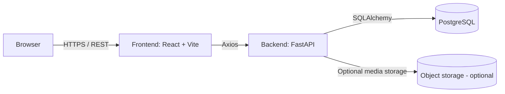
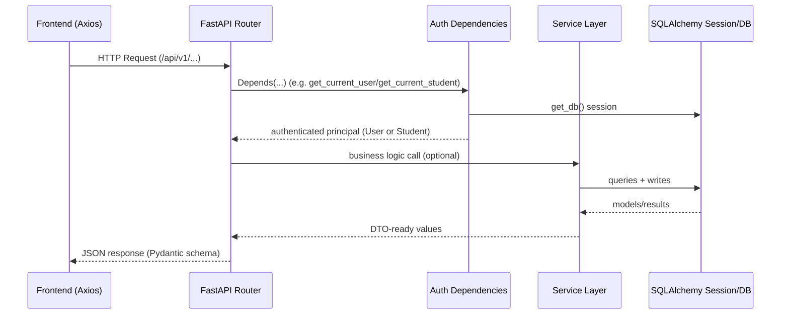
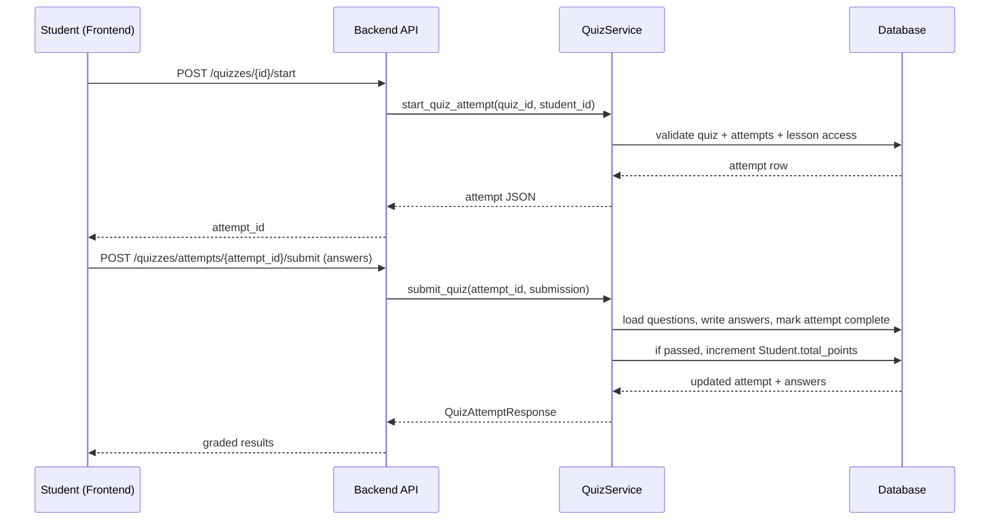

# System Architecture (Code-Level View)

This page describes how the Kids Delight Learning Platform is structured in code and how the major runtime flows work.

For the broader system doc, see [ARCHITECTURE.md](file:///c:/Users/USER/Project/Kids-Bible_platform/ARCHITECTURE.md).

## High-Level Architecture

- Frontend: React (Vite) app under [frontend/](file:///c:/Users/USER/Project/Kids-Bible_platform/frontend/)
- Backend: FastAPI app under [backend/](file:///c:/Users/USER/Project/Kids-Bible_platform/backend/)
- Database: PostgreSQL (or SQLite in development) via SQLAlchemy models under [backend/app/models/](file:///c:/Users/USER/Project/Kids-Bible_platform/backend/app/models/)

## Recommended Free Hosting Split

- Frontend: Netlify or Vercel
- Backend API: Koyeb
- Database: PostgreSQL hosted on Oracle Cloud infrastructure



## Repository Layout

```
Kids-Bible_platform/
  backend/                 # Python/FastAPI API server
    app/                   # Application code (routers, models, schemas, services)
    alembic/               # Migrations
    tests/                 # pytest suite
  frontend/                # React/TypeScript client
    src/                   # app code (routes, pages, layouts, components)
  deploy/                  # deployment notes/manifests
  docker-compose.yml        # local orchestration
  README.md / SETUP.md      # operational documentation
  docs/wiki/                # this code wiki
```

## Backend Runtime: Request Lifecycle

### App Boot

- FastAPI app defined in [main.py](file:///c:/Users/USER/Project/Kids-Bible_platform/backend/app/main.py#L12-L64)
- Router mounted under `/api/v1` via [api_router include](file:///c:/Users/USER/Project/Kids-Bible_platform/backend/app/main.py#L60-L62) and [api/v1/__init__.py](file:///c:/Users/USER/Project/Kids-Bible_platform/backend/app/api/v1/__init__.py)
- DB and models are initialized through SQLAlchemy metadata registration in [models/__init__.py](file:///c:/Users/USER/Project/Kids-Bible_platform/backend/app/models/__init__.py)

### Request Path (Typical)



## Key Domain Flows

### Authentication and Roles

- JWT creation + decoding: [security.py](file:///c:/Users/USER/Project/Kids-Bible_platform/backend/app/core/security.py#L29-L69)
- User auth dependency (rejects student tokens): [get_current_user](file:///c:/Users/USER/Project/Kids-Bible_platform/backend/app/core/security.py#L71-L117)
- Student auth dependency (requires `student_id` in JWT): [get_current_student](file:///c:/Users/USER/Project/Kids-Bible_platform/backend/app/core/security.py#L150-L171)
- Role guards used by endpoints: [RoleChecker + require_*](file:///c:/Users/USER/Project/Kids-Bible_platform/backend/app/core/security.py#L128-L148)

```mermaid
flowchart TD
  Login[POST /auth/login] --> JWT[Issue JWTs]
  StudentLogin[POST /auth/student-login] --> JWT
  JWT --> FEStore[Frontend stores access_token/refresh_token]
  FEStore --> Req[Subsequent requests with Authorization header]
  Req --> Decode[decode_token()]
  Decode --> UserOrStudent{student_id present?}
  UserOrStudent -->|no| CurrentUser[get_current_user]
  UserOrStudent -->|yes| CurrentStudent[get_current_student]
```

### Lessons + Progress Tracking

At the API level:
- Student starts a lesson: [progress.py start_lesson](file:///c:/Users/USER/Project/Kids-Bible_platform/backend/app/api/v1/progress.py)
- Student updates progress: [progress.py update_progress](file:///c:/Users/USER/Project/Kids-Bible_platform/backend/app/api/v1/progress.py)
- Student lesson listing with progress overlay: [lessons.py list_for_student](file:///c:/Users/USER/Project/Kids-Bible_platform/backend/app/api/v1/lessons.py)

Service layer:
- Progress calculations + dashboards: [ProgressService](file:///c:/Users/USER/Project/Kids-Bible_platform/backend/app/services/progress_service.py)

### Quizzes: Attempt + Auto-Grading

- Attempt creation with max-attempt checks: [QuizService.start_quiz_attempt](file:///c:/Users/USER/Project/Kids-Bible_platform/backend/app/services/quiz_service.py#L78-L123)
- Auto-grading loop + attempt finalization: [QuizService.submit_quiz](file:///c:/Users/USER/Project/Kids-Bible_platform/backend/app/services/quiz_service.py#L126-L211)
- Student points award on pass: [submit_quiz points update](file:///c:/Users/USER/Project/Kids-Bible_platform/backend/app/services/quiz_service.py#L190-L195)



### Chat + Moderation

- Access control helpers + endpoints: [chat.py](file:///c:/Users/USER/Project/Kids-Bible_platform/backend/app/api/v1/chat.py)
- Group and direct-chat management: [groups.py](file:///c:/Users/USER/Project/Kids-Bible_platform/backend/app/api/v1/groups.py)
- Frontend chat UI and moderation actions: [ChatWindow.tsx](file:///c:/Users/USER/Project/Kids-Bible_platform/frontend/src/components/chat/ChatWindow.tsx)
