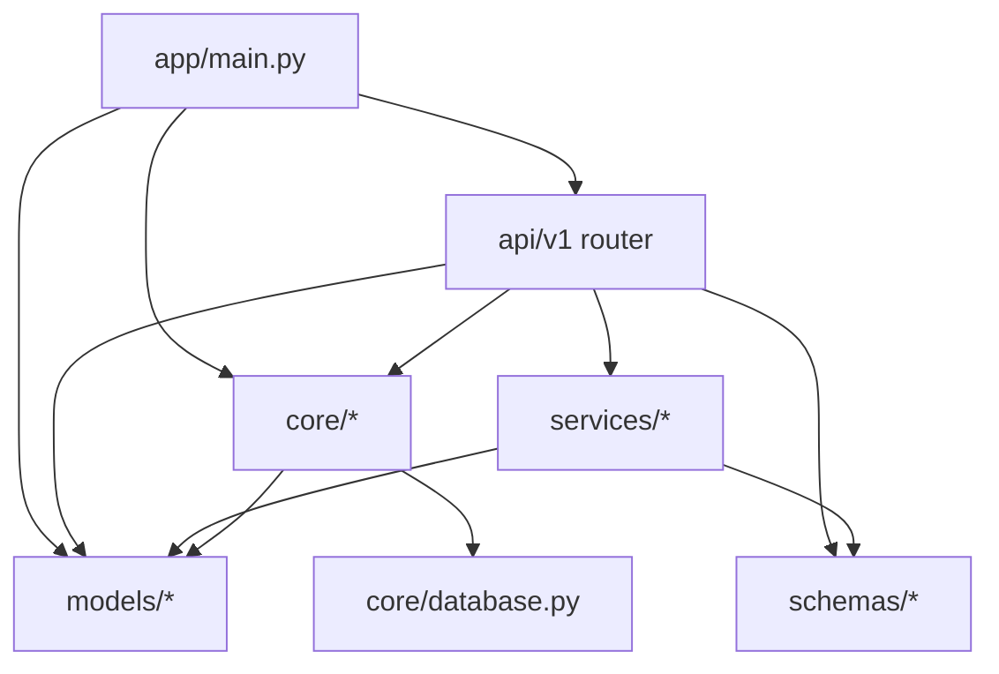
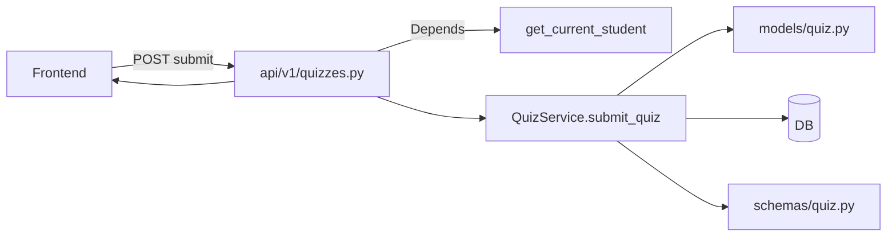
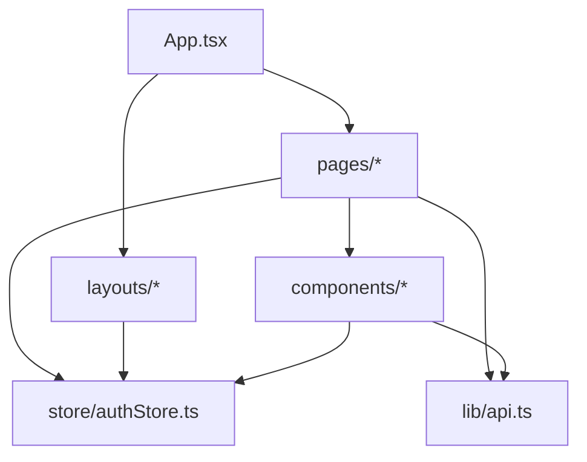

# Dependency Relationships

This page documents how modules depend on each other in both backend and frontend, and where the major boundaries are.

## Backend Dependency Graph (Conceptual)

Key layers:
- API layer: [backend/app/api/v1/](file:///c:/Users/USER/Project/Kids-Bible_platform/backend/app/api/v1/)
- Core utilities (config/db/security): [backend/app/core/](file:///c:/Users/USER/Project/Kids-Bible_platform/backend/app/core/)
- Business logic services: [backend/app/services/](file:///c:/Users/USER/Project/Kids-Bible_platform/backend/app/services/)
- Data models: [backend/app/models/](file:///c:/Users/USER/Project/Kids-Bible_platform/backend/app/models/)
- Schemas/DTOs: [backend/app/schemas/](file:///c:/Users/USER/Project/Kids-Bible_platform/backend/app/schemas/)

### Entry Point and Routing

- App bootstrap: [main.py](file:///c:/Users/USER/Project/Kids-Bible_platform/backend/app/main.py#L19-L64)
- Router aggregation: [api/v1/__init__.py](file:///c:/Users/USER/Project/Kids-Bible_platform/backend/app/api/v1/__init__.py)

### Auth Dependencies

- Token + role dependencies: [security.py](file:///c:/Users/USER/Project/Kids-Bible_platform/backend/app/core/security.py#L29-L171)
- Settings consumed by security: [config.py](file:///c:/Users/USER/Project/Kids-Bible_platform/backend/app/core/config.py#L6-L48)
- DB session dependency: [get_db](file:///c:/Users/USER/Project/Kids-Bible_platform/backend/app/core/database.py#L30-L36)

## Backend “Request Path” Dependency (Concrete)

Example: `POST /api/v1/quizzes/attempts/{attempt_id}/submit`

- Endpoint module: [api/v1/quizzes.py](file:///c:/Users/USER/Project/Kids-Bible_platform/backend/app/api/v1/quizzes.py)
- Authorization: [get_current_student](file:///c:/Users/USER/Project/Kids-Bible_platform/backend/app/core/security.py#L150-L171)
- Business logic: [QuizService.submit_quiz](file:///c:/Users/USER/Project/Kids-Bible_platform/backend/app/services/quiz_service.py#L126-L211)
- Models touched: [QuizAttempt + Answer + Question](file:///c:/Users/USER/Project/Kids-Bible_platform/backend/app/models/quiz.py)
- Response schema: [QuizAttemptResponse](file:///c:/Users/USER/Project/Kids-Bible_platform/backend/app/schemas/quiz.py)

## Frontend Dependency Graph (Conceptual)

Key layers:
- Route map: [App.tsx](file:///c:/Users/USER/Project/Kids-Bible_platform/frontend/src/App.tsx)
- Layout shells: [frontend/src/layouts/](file:///c:/Users/USER/Project/Kids-Bible_platform/frontend/src/layouts/)
- Pages (route endpoints): [frontend/src/pages/](file:///c:/Users/USER/Project/Kids-Bible_platform/frontend/src/pages/)
- Shared components: [frontend/src/components/](file:///c:/Users/USER/Project/Kids-Bible_platform/frontend/src/components/)
- State: [authStore.ts](file:///c:/Users/USER/Project/Kids-Bible_platform/frontend/src/store/authStore.ts)
- API client and endpoints: [api.ts](file:///c:/Users/USER/Project/Kids-Bible_platform/frontend/src/lib/api.ts)

## Cross-Cutting Dependencies (Front ↔ Back)

Primary contract:
- Backend routes under `/api/v1/...` via [api_router mount](file:///c:/Users/USER/Project/Kids-Bible_platform/backend/app/main.py#L60-L62)
- Frontend base URL configured by `VITE_API_BASE_URL` in [api.ts](file:///c:/Users/USER/Project/Kids-Bible_platform/frontend/src/lib/api.ts#L3-L4)

Important runtime assumption:
- Frontend stores tokens in `localStorage` (keys `access_token`, `refresh_token`) via [useAuthStore.setAuth](file:///c:/Users/USER/Project/Kids-Bible_platform/frontend/src/store/authStore.ts#L44-L53)
- Axios attaches `Authorization: Bearer <token>` header on every request via interceptor in [api.ts](file:///c:/Users/USER/Project/Kids-Bible_platform/frontend/src/lib/api.ts#L39-L45)

